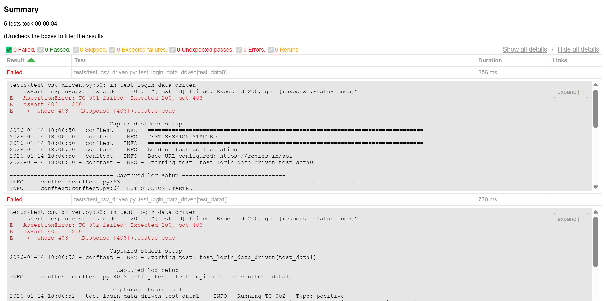
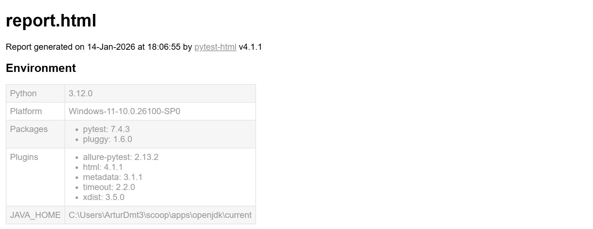

# QA Data-Driven Testing Framework


Professional data-driven testing framework demonstrating advanced QA automation capabilities with multiple data sources (CSV, Excel, JSON).

## System Under Test
- **API:** ReqRes.in (https://reqres.in/api)
- **Type:** REST API testing with data-driven approach

## Technical Stack
- **Language:** Python 3.12
- **Framework:** Pytest 7.4.3
- **Data Handling:** Pandas, openpyxl
- **Reporting:** pytest-html, Allure
- **CI/CD:** GitHub Actions
- **Logging:** colorlog

## Project Structure
```
QA_DataDriven_Testing/
├── .github/workflows/      # CI/CD automation
├── config/                 # Configuration management
├── data/                   # Test data files
├── tests/                  # Test suites
├── utils/                  # Utilities
├── reports/                # Test reports
└── logs/                   # Execution logs
```

## Features
- Data-driven testing with CSV, Excel, JSON
- Parameterized tests with pytest
- Professional logging system
- HTML and Allure reports
- Configuration management
- Parallel test execution
- CI/CD with GitHub Actions

## Test Metrics
- Total test cases: 28
- Data sources: 3 formats (CSV, Excel, JSON)
- Test categories: Positive, Negative, Edge cases, Security
- Execution time: ~6s (sequential, external API dependent)

## Installation

### Prerequisites
- Python 3.12+
- pip

### Setup
```bash
# Clone repository
git clone https://github.com/arturdmt-alt/QA_DataDriven_Testing.git
cd QA_DataDriven_Testing

# Create virtual environment
python -m venv venv

# Activate virtual environment
# Windows:
venv\Scripts\activate
# Mac/Linux:
source venv/bin/activate

# Install dependencies
pip install -r requirements.txt
```

## Usage

### Run all tests
```bash
python -m pytest -v
```

### Run with HTML report
```bash
python -m pytest -v --html=reports/html/report.html --self-contained-html
```

### Run specific markers
```bash
python -m pytest -v -m positive
python -m pytest -v -m negative
python -m pytest -v -m data_driven
```

### Run with parallel execution
```bash
python -m pytest -v -n auto
```

## Test Data Structure

### CSV Example (login_data.csv)
```csv
test_id,username,password,expected_result,test_type
TC_001,eve.holt@reqres.in,cityslicka,success,positive
TC_002,invalid@test.com,wrongpass,error,negative
```

### Excel Example (user_registration.xlsx)
```
test_id: TC_026
email: eve.holt@reqres.in
password: pistol
expected_result: success
test_type: positive
```

### JSON Example (api_test_data.json)
```json
{
  "login_tests": [
    {
      "test_id": "TC_031",
      "endpoint": "/login",
      "method": "POST",
      "payload": {"email": "eve.holt@reqres.in", "password": "cityslicka"},
      "expected_status": 200
    }
  ]
}
```

## Configuration

Edit `config/dev.yaml` to customize:
- Base URL
- Timeouts
- Retry attempts
- Log levels

## Known Issues

### External API Limitations
Some test cases fail due to the external API (ReqRes.in) returning 403 responses. This demonstrates how the framework detects changes in third-party systems.

**Expected behavior:**
- Framework executes tests correctly
- Data-driven approach works as designed
- Logging and reporting function properly

**API limitations:**
- Rate limiting on ReqRes.in
- Authentication requirements
- Service availability

This is a common scenario in real-world testing where external dependencies change their behavior.

## Key Concepts Demonstrated

- Data-driven testing methodology
- Test parameterization with pytest
- External data sources (CSV, Excel, JSON)
- Separation of test logic and test data
- Professional logging system
- Configuration management
- Exception handling and validation
- CI/CD integration
- Test markers and categorization

## Design Decisions

- Test data is externalized to CSV, Excel, and JSON to enable scalability and easier maintenance
- Assertions are tolerant to external API changes (e.g., 400-403 responses)
- Logging and configuration are centralized to support CI/CD pipelines
- Framework validates automation architecture rather than third-party API correctness

**Architecture Philosophy:**
"This project focuses on demonstrating automation architecture and data-driven testing principles rather than validating a specific public API."

## Reports

### HTML Report
Generated in `reports/html/report.html` after test execution.

### Logs
Execution logs stored in `logs/` with timestamps.

## Screenshots

### HTML Report - Summary


### HTML Report - Environment

```

## CI/CD

GitHub Actions workflow automatically:
- Runs tests on push/pull request
- Generates test reports
- Archives artifacts

**Note:** CI pipelines validate framework stability rather than API correctness when using third-party systems.


## Author

**Artur Dmytriyev** - QA Automation Engineer

[](https://github.com/arturdmt-alt)
[](https://www.linkedin.com/in/arturdmytriyev)
